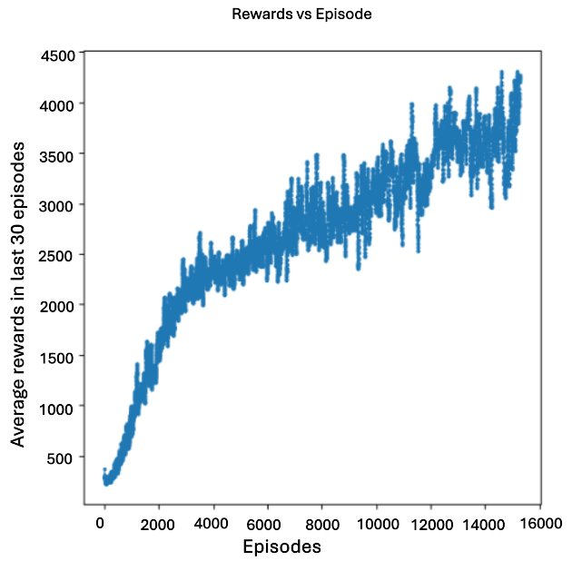

### RL Swin Transformer for Ms. Pac-Man

This repository implements **Reinforcement Learning (RL) with Swin Transformer** in the **Ms. Pac-Man** environment. It compares Deep RL techniques such as **DQN, Double DQN, Dueling DQN, Split Q-Learning, and A2C/A3C**, with a focus on **Double DQN with Swin Transformers**.

### Installation
```bash
git clone https://github.com/reza-sf9/RL-Swin-Transformer.git
cd RL-Swin-Transformer
python -m venv rl_env
source rl_env/bin/activate  # Linux/Mac
rl_env\Scripts\activate     # Windows
pip install -r requirements.txt
```

### Training
```bash
python train.py --env MsPacman-v5 --model swin_dqn --episodes 100000
```

### Evaluation
```bash
python evaluate.py --model swin_dqn --episodes 100
```

### Results
 <!-- Placeholder for training curve image -->

| Model               | Avg Score | Max Score |
|--------------------|------------|------------|
| Standard DQN      | 2,769.9    | 6,380      |
| Double Dueling DQN | 3,734.4    | 7,900      |
| Split Q-Learning  | 3,052.7    | 5,000      |
| **Swin DQN**      | **4,285**  | **7,640**  |

### Swin Transformer Hyperparameters
| Hyperparameter       | Value         | Description |
|----------------------|--------------|-------------|
| Learning Rate       | 6.25×        | Step size for updates |
| Discount Factor     | 0.99         | Discount factor for future rewards |
| Batch Size         | 32           | Number of experiences sampled from replay buffer per update |
| Replay Buffer Size | 1,000,000    | Maximum number of experiences stored in replay buffer |
| Target Network Update | 10,000    | Frequency of updating target network with Q-network parameters |
| Epsilon Start      | 1.0          | Initial epsilon value for epsilon-greedy policy |
| Epsilon End        | 0.01         | Minimum epsilon value after decay |
| Frame Stack Size   | 4            | Number of frames stacked to create a single observation |
| Input Frame Size   | 84x84 pixels | Resized input frame dimensions |
| Optimizer         | Adam         | Optimization algorithm used for training |
| Loss Function      | Huber Loss   | Loss function to minimize (also called Smooth L1 Loss) |
| Total Steps       | 16,000,000   | Number of training steps |
| Total Episodes    | 15,000       | Number of training episodes |
| Moving Average Window | 30       | Window size for calculating moving average of rewards (for monitoring) |

### Future Work
- Extend training beyond 10,000 episodes.
- Optimize Swin Transformer inference speed.
- Fine-tune reward shaping for improved strategy.

### Contributors
- Maya Flores
- José Manuel Pérez Jiménez
- Joe Molder
- Reza Saadati Fard
- Zhiwei Yang

### References
1. Mnih et al., "Human-level control through deep reinforcement learning," *Nature*, 2015.
2. Hasselt et al., "Deep Reinforcement Learning with Double Q-learning," *arXiv preprint*, 2015.
3. Wang et al., "Dueling Network Architectures for Deep RL," *ICML*, 2016.
4. Liu et al., "Swin Transformer: Hierarchical Vision Transformer using Shifted Windows," *ICCV*, 2021.
```

